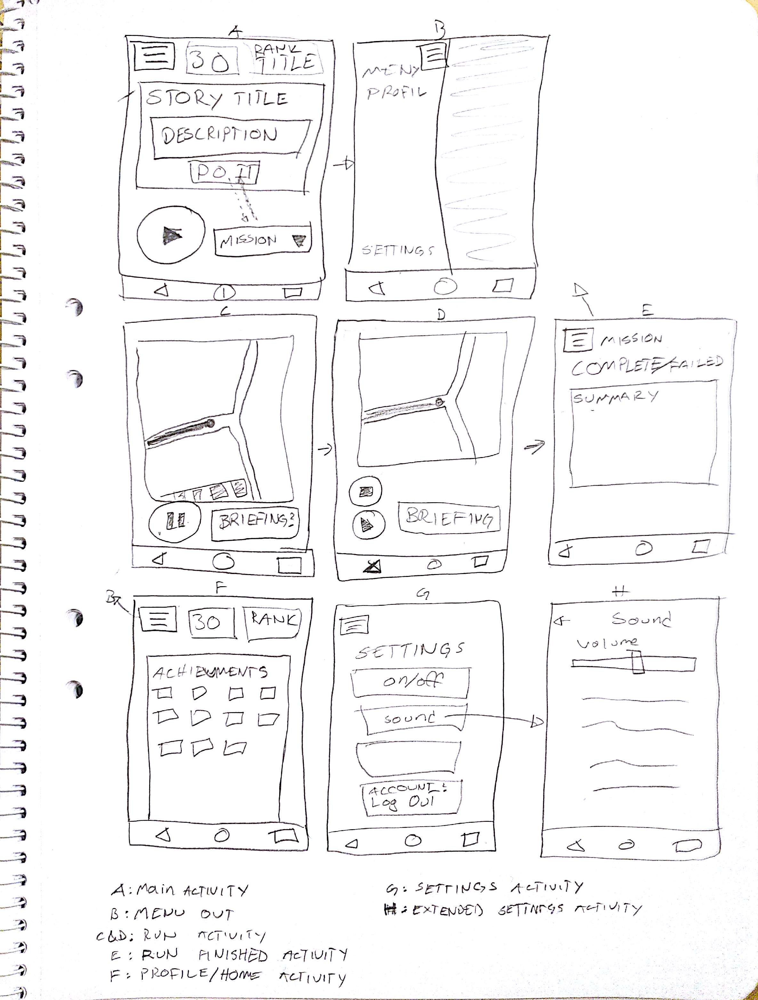

# Swoosh

## Introduction
This app is for the course TDP028 at Linköping University.
The main goal of the course is NOT the app itself but the fluff around the making of an app, such as:
* A/B-testing.
* Monetizing.
* Best practices in app-design.
* Gathering of statistical data concerning the use of my app.
* Making beneficial use of this statistical data.

## About the app
I am planning to make a simple game of the usual jog.
This includes:
* Running-missions app-wide where you compete on a local, country or world level.
* Achievements.
* Experience-points that lets the player level up.
* Titles for each level-bracket.

## Alpha version
The alpha version should be able to:
* Navigate between the different activities.
* All different views should be in place.
* It is not supposed to look good at all.
* There should be a map.

## Beta version
The beta version should be able to:
* User creation and log in.
* Should be able to track a run.
* Should be able to save the tracked run.
* Should be able to fetch run data from database.
* Get achievements.
* Get experience points.
* Level-Up.

## Gamma version
The gamma version should be able to:
* Share a run.
* Share "stats".

## Delta version
The delta version should be able to:
* Be able to have friends.
* Show friends/local/country/world brackets.

## Epsilon version
The epsilon version should be able to:
* User can now pick a team.
* Team brackets now exists.

## Where I Assume I'll end up when course finishes
Either Beta or Gamma version. This is due to other courses, me being new to Android, and that time is limited.
I have my hopes up.

## Lo-fi
The second version of the Lo-fi is seen here.

